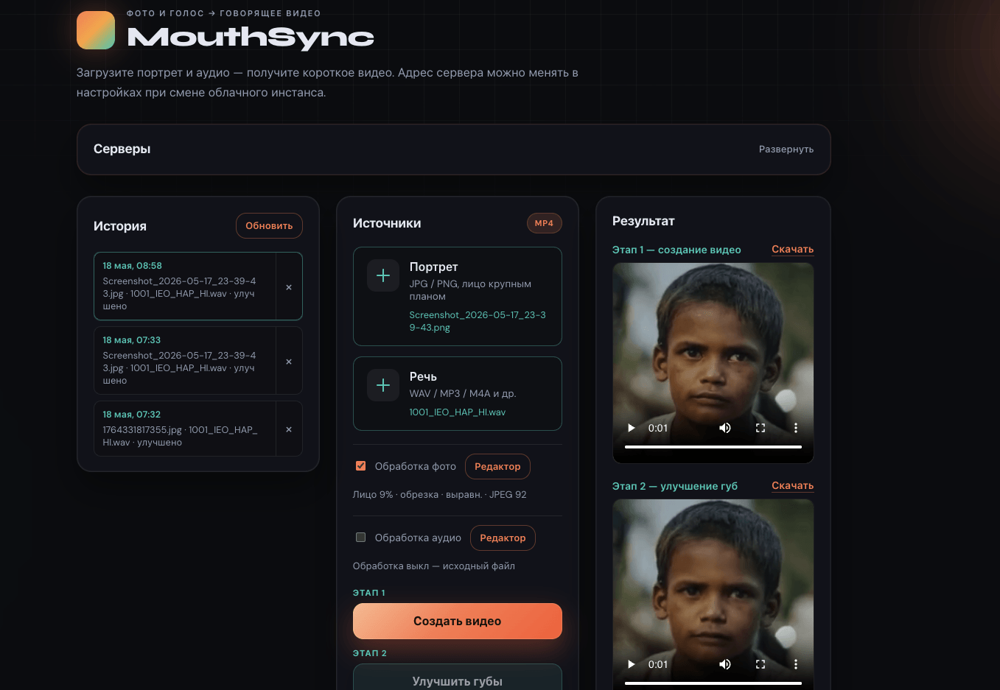
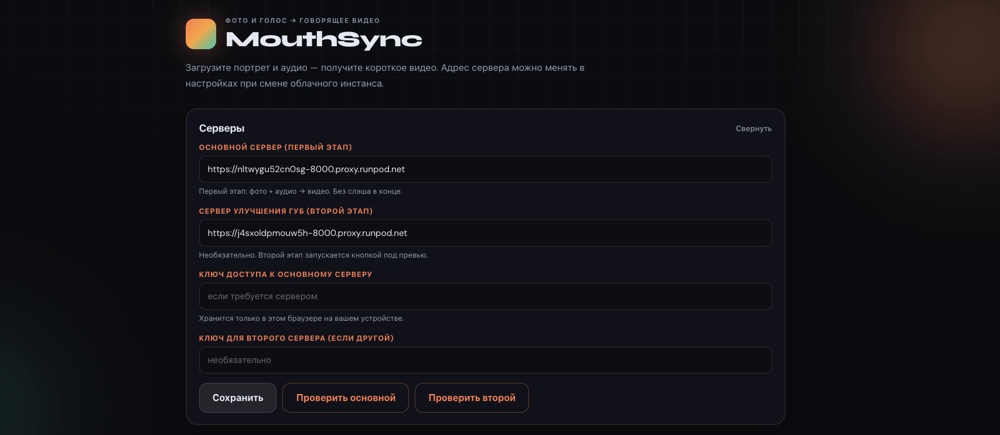
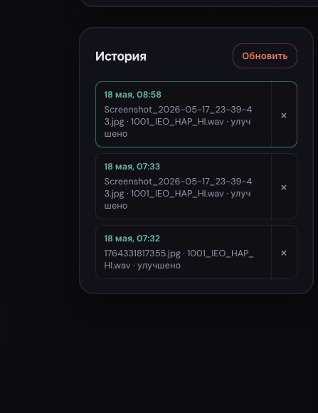
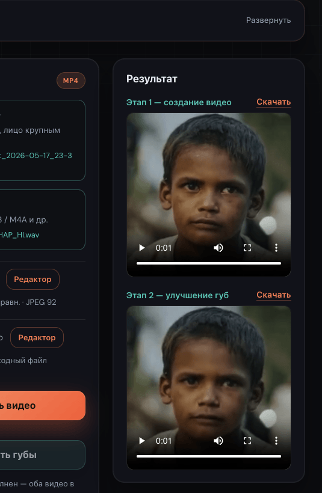
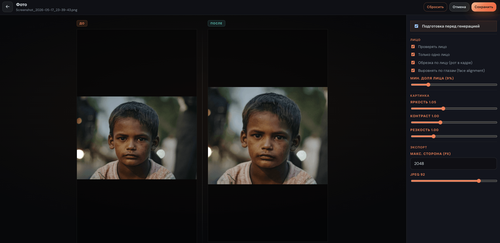

# MouthSync

**Lip-sync** from a portrait and audio → short video. Local **backend** (`backend/`, FastAPI) and **UI** (`frontend/`, React + Vite); heavy rendering runs on a **remote worker**. Configure via `.env` at the repo root (template: `.env.example`).

**Worker registry:** [workers/README.md](./workers/README.md)

**Deploy (macOS / Windows / Linux):** [DEPLOY.md](./DEPLOY.md)

**Full RunPod walkthrough (from scratch):** [RUNPOD.md](./RUNPOD.md)

**UI screenshots:** [screenshots/](./screenshots/)

---

## Screenshots

| Main — upload & generate | Worker (RunPod) settings |
|:---:|:---:|
|  |  |

| History | Result / playback |
|:---:|:---:|
|  |  |

| Photo & audio prep |
|:---:|
|  |

---

## Docker images

Replace **`YOUR_DOCKER_USER`** with your [Docker Hub](https://hub.docker.com/) username (`export DOCKER_USER=...`).

| Image | Role | README | Docker Hub |
|-------|------|--------|------------|
| `mouthsync-backend` | API, prep, history (local compose) | [backend/README.md](./backend/README.md) | optional — [hub.docker.com/r/YOUR_DOCKER_USER/mouthsync-backend](https://hub.docker.com/r/YOUR_DOCKER_USER/mouthsync-backend) |
| `mouthsync-frontend` | Web UI (local compose) | [frontend/README.md](./frontend/README.md) | optional — [hub.docker.com/r/YOUR_DOCKER_USER/mouthsync-frontend](https://hub.docker.com/r/YOUR_DOCKER_USER/mouthsync-frontend) |
| `mouthsync-worker-sadtalker` | **Stage 1** — talking head | [runpod-worker-sadtalker/README.md](./runpod-worker-sadtalker/README.md) | [hub.docker.com/r/YOUR_DOCKER_USER/mouthsync-worker-sadtalker](https://hub.docker.com/r/YOUR_DOCKER_USER/mouthsync-worker-sadtalker) |
| `mouthsync-worker-wav2lip` | **Stage 2** — lip refine | [runpod-worker-wav2lip/README.md](./runpod-worker-wav2lip/README.md) | [hub.docker.com/r/YOUR_DOCKER_USER/mouthsync-worker-wav2lip](https://hub.docker.com/r/YOUR_DOCKER_USER/mouthsync-worker-wav2lip) |

Publish RunPod workers:

```bash
export DOCKER_USER=your_docker_hub_username
make hub-login
make worker-publish-ready   # sadtalker + wav2lip
```

---

## Prerequisites

Install tools **before** the first run. Step-by-step per OS: **[DEPLOY.md](./DEPLOY.md)**.

| | macOS | Windows | Linux |
|---|--------|---------|--------|
| **Docker** | [Docker Desktop](https://docs.docker.com/desktop/setup/install/mac-install/) | [Docker Desktop](https://docs.docker.com/desktop/setup/install/windows-install/) + **WSL 2** | [Docker Engine](https://docs.docker.com/engine/install/) + [Compose](https://docs.docker.com/compose/install/linux/) |
| **Git** | Xcode CLT / brew | [git-scm.com](https://git-scm.com/download/win) | `apt` / `dnf` |
| **Make** | `xcode-select --install` | **WSL:** `apt install make` (recommended) | `apt install make` |
| **Terminal** | Terminal.app / iTerm | **Ubuntu (WSL)** for bash commands | bash / zsh |

You do **not** need Python or Node on the host if you use Docker for UI + backend.

**For publishing worker images to RunPod** (optional until you deploy a remote worker):

| Tool | Purpose | Link |
|------|---------|------|
| **[Docker Hub](https://hub.docker.com/)** account | Push images (`make worker-*-publish`) | [hub.docker.com](https://hub.docker.com/) |
| **[RunPod](https://www.runpod.io)** account | GPU/CPU Pods for inference | [runpod.io](https://www.runpod.io) |

**For local SadTalker / Wav2Lip workers** (GPU profiles only):

| Tool | Purpose | Link |
|------|---------|------|
| **NVIDIA GPU** + driver | Neural rendering | [NVIDIA drivers](https://www.nvidia.com/Download/index.aspx) |
| **[NVIDIA Container Toolkit](https://docs.nvidia.com/datacenter/cloud-native/container-toolkit/install-guide.html)** | GPU inside Docker | [Install guide](https://docs.nvidia.com/datacenter/cloud-native/container-toolkit/install-guide.html) |

**Optional — run backend or frontend on the host** (without Docker for that service):

| Tool | Version | Link |
|------|---------|------|
| **[Python](https://www.python.org/downloads/)** | 3.10+ (backend uses 3.10 in Docker) | [python.org](https://www.python.org/downloads/) |
| **[Node.js](https://nodejs.org/)** | 20 LTS (frontend uses Node 20 in Docker) | [nodejs.org](https://nodejs.org/) |

Verify Docker and Compose:

```bash
docker --version
docker compose version
make --version
```

---

## Quick start — run locally

All commands below are run from the **`mouthsync/`** directory (next to `docker-compose.yml` and `Makefile`).  
Platform-specific notes (paths, WSL, port conflicts): **[DEPLOY.md](./DEPLOY.md)**.

### 1. Clone and configure

```bash
git clone https://github.com/suhaircoder/mouthsync.git
cd mouthsync
make env
```

Edit **`.env`** (created from [`.env.example`](./.env.example)). For a first run you can leave `WORKER_URL` empty and set the worker URL later in the UI.

### 2. Choose how to run

#### Option A — Backend + UI only (workers on RunPod)

Use this when inference runs on a remote Pod. Set **WORKER_URL** in the UI at [http://localhost:3000](http://localhost:3000) or in `.env`.

```bash
make up-detached    # or: make up-build
make ps             # check containers
```

| Service | URL |
|---------|-----|
| UI | [http://localhost:3000](http://localhost:3000) |
| Backend API | [http://localhost:8000](http://localhost:8000) |
| MongoDB | `localhost:27017` (used by backend for history/settings) |

Stop: `make down`

#### Option B — Local UI + backend (workers on RunPod)

Runs **frontend + backend + MongoDB** in Docker. Set **WORKER_URL** and **Wav2Lip URL** in the UI (RunPod Pods).

```bash
make local-detached   # recommended: background
make local-ps
make local-logs       # optional: follow logs
```

| Service | URL |
|---------|-----|
| UI | [http://localhost:3000](http://localhost:3000) |
| Backend | [http://localhost:8000](http://localhost:8000) |

Stop: `make local-down`

#### Option C — SadTalker worker locally (NVIDIA GPU)

Requires [NVIDIA Container Toolkit](#prerequisites). UI/backend can stay on the default compose stack; start SadTalker with the `sadtalker-worker` profile:

```bash
docker compose --profile sadtalker-worker up --build worker-sadtalker
```

SadTalker on the host: [http://127.0.0.1:9001](http://127.0.0.1:9001). Point **WORKER_URL** in the UI to that URL (or use a RunPod SadTalker URL instead).

### 3. Smoke test

```bash
curl -sS http://localhost:8000/health
```

Open the UI → upload portrait + audio → generate. If using RunPod, paste the Pod URL under **Worker (RunPod)** and click **Save**, then **Test connection**.

### 4. Remote worker (RunPod) — summary

1. Build and push: `make worker-sadtalker-publish` and `make worker-wav2lip-publish`.
2. Create **two** Pods on [RunPod](https://www.runpod.io) (SadTalker + Wav2Lip), **HTTP port 8000** each.
3. In the UI: **WORKER_URL** (stage 1) and **Wav2Lip URL** (stage 2) — `https://<POD_ID>-8000.proxy.runpod.net` (no trailing slash).

Details: sections below and [RUNPOD.md](./RUNPOD.md).

---

## Generation history

After each successful generation the backend stores:

- video `output.mp4`
- source photo and audio
- metadata (filenames, timestamp)

Files live under **`backend/data/history/`** (Docker volume: `./backend/data`).

In the UI, the **History** panel lets you replay and delete entries.

API:

- `GET /api/history` — list entries
- `GET /api/history/{id}/video` — video file
- `DELETE /api/history/{id}` — delete entry

---

## Worker settings in the UI

At **http://localhost:3000**, section **Worker (RunPod)**:

- **WORKER_URL** and **WORKER_API_KEY** are stored in this browser’s **localStorage**.
- After each **new RunPod Pod**, paste the new URL and click **Save** — editing `.env` is optional.
- **Test connection** calls `GET /api/worker-status` on the backend (same URL used for generation).
- If the URL field is **empty**, the backend falls back to **`WORKER_URL` from `.env`** (handy for default docker compose).

Priority: **UI values** → **backend `.env`**.

---

## `WORKER_URL` and `WORKER_API_KEY`

| Variable | Purpose |
|----------|---------|
| **`WORKER_URL`** | Public URL of **your** service on the RunPod Pod **without** the `/infer` path (no trailing slash). The backend appends `/infer` automatically. Example: `https://<pod-id>-8000.proxy.runpod.net` |
| **`WORKER_API_KEY`** | This is **not** your RunPod account API key. It is a **secret you choose** in the worker’s Pod env vars and the same value in local `.env` — the backend sends it as header `X-Worker-Key`. Leave empty in `.env` if the worker has no key. |

The RunPod dashboard API key (REST/CLI) is **not** required for this worker.

---

## 1. SadTalker worker (stage 1, GPU)

Talking head via [SadTalker](https://github.com/OpenTalker/SadTalker). Directory: **`runpod-worker-sadtalker/`**. API: `GET /health`, `POST /infer`.

### Build and push

```bash
export DOCKER_USER=<username>
make hub-login
make worker-sadtalker-publish
```

Image: `docker.io/<DOCKER_USER>/mouthsync-worker-sadtalker:latest`

`/health` after start (model load may take 1–3 min):

```json
{"status":"ok","backend":"sadtalker","device":"cuda","models_loaded":true,"size":256,...}
```

### RunPod

- **Container image:** `docker.io/<DOCKER_USER>/mouthsync-worker-sadtalker:latest`
- **GPU:** RTX 3090 / 4090 or similar
- **Expose HTTP ports:** `8000`
- **Container disk:** **≥ 20 GB**

Set **WORKER_URL** in the MouthSync UI to the SadTalker Pod URL (`https://<id>-8000.proxy.runpod.net`).

---

## 2. Wav2Lip worker (stage 2, GPU lip refine)

Directory: **`runpod-worker-wav2lip/`**. API: `GET /health`, `POST /refine` (video + audio). Rendering via [Wav2Lip](https://github.com/Rudrabha/Wav2Lip).

```bash
export DOCKER_USER=<username>
make worker-wav2lip-publish
```

Image: `docker.io/<DOCKER_USER>/mouthsync-worker-wav2lip:latest`

**GPU Pod** recommended (RTX 3090/4090), port **8000**, disk **≥ 15 GB**. Set **Wav2Lip URL** in the UI to this Pod.

---

## 3. Create RunPod Pods

1. Sign in at [runpod.io](https://www.runpod.io) → **Pods**.
2. **Deploy** a new Pod.
3. **Container image:** `mouthsync-worker-sadtalker:latest` and `mouthsync-worker-wav2lip:latest`.
4. **Expose HTTP ports:** **`8000`** — uvicorn listens on 8000 inside the container. Without this, no public proxy URL.  
   Docs: [Expose ports](https://docs.runpod.io/pods/configuration/expose-ports).
5. (Optional) **Environment:** `WORKER_API_KEY` = long random string; same in local `.env`.
6. Wait for **Running**.

---

## 3. Get `WORKER_URL`

Public URL format:

`https://<POD_ID>-8000.proxy.runpod.net`

Copy the full URL **without** a trailing slash. In `.env`:

```env
WORKER_URL=https://<POD_ID>-8000.proxy.runpod.net
```

Check from your machine:

```bash
curl -sS "https://<POD_ID>-8000.proxy.runpod.net/health"
```

Expected: `{"status":"ok",...}`.

With `WORKER_API_KEY` on the worker:

```bash
curl -sS -H "X-Worker-Key: <YOUR_SECRET>" "https://<POD_ID>-8000.proxy.runpod.net/health"
```

---

## 4. Run locally

See **[Quick start — run locally](#quick-start--run-locally)** for prerequisites, `make env`, Option A/B/C, and smoke tests.

Vite proxies `/api` from the UI to the **`backend`** service; the backend calls the worker at **`WORKER_URL`** (UI → `.env` → default).

---

## 5. RunPod HTTP proxy limit

The public HTTP proxy has a **~100 second** connection limit (Cloudflare **524** on long jobs). SadTalker/Wav2Lip on long audio may hit this. Use shorter clips for tests or async hosting later.

---

## 6. Local stack in Docker

**[Option B](#option-b--local-ui--backend-workers-on-runpod)** (UI + backend) and **[Option C](#option-c--sadtalker-worker-locally-nvidia-gpu)** (local SadTalker GPU). `make local-up` / `make local-down`.

---

## Makefile

From **`mouthsync/`**:

| Command | Action |
|---------|--------|
| `make help` | list targets |
| `make env` | create `.env` from `.env.example` if missing |
| `make up-detached` | backend + UI (RunPod worker via UI/env) |
| `make down` | stop backend + UI |
| `make local-detached` | **recommended**: UI + backend (RunPod workers in UI) |
| `make local-down` | stop local stack |
| `make local-ps` / `make local-logs` | status / logs |
| `make hub-login` | Docker Hub login |
| `make worker-list` | workers (sadtalker, wav2lip) |
| `make worker-publish` | alias → SadTalker image |
| `make worker-sadtalker-publish` | SadTalker image |
| `make worker-wav2lip-publish` | Wav2Lip image |
| `make worker-publish-ready` | push both workers |

---

## Environment files

- Project root: **`.env`** (do not commit; see **`.gitignore`** and **`.env.example`**).
- Also: `backend/.env.example` — reminder about root `.env`.
